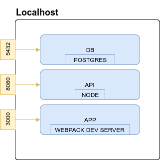
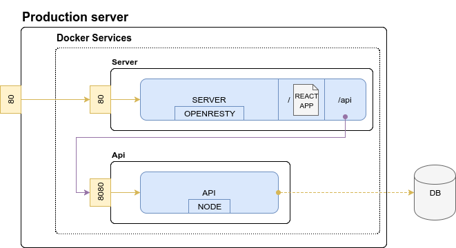
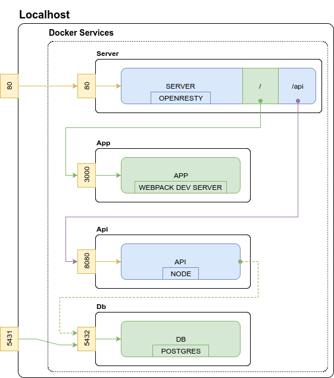

# How to Dockerize your Express/React app and still use your favorite Webpack plugins

Your project is organized though different technical services e.g. back-office, front-end application, back-end application, database.

While you could run all these services at once on one server, wouldn't it be nice to make them live separatly? Then you can manage each of your technical services individually:
- **how they interact** with one another;
- prevent one from stealing shared resources as **each one has its own resources**;
- and watch running parts of your application **the same way you architected your application**.

Still, it is really difficult to make them live separately on several physical servers. **Docker** is the solution: it lets you separate your architecture in several autonomous services. Now taht you are convinced you want to use Docker, you fear loosing all your great **Webpack** plugins such as *React-hot-loader*.


**This tutorial will guide you through Dockerizing a sample Express/React project which uses Webpack and its plugins in a development environnement.**

> For this tutorial, you will need Docker and Docker-compose.

## Kicking off our example project.

For this tutorial, let's assume we own a simple React web-application supported by three services :

- a Postgres **database** which uses port `5432` on `localhost` locally.
- a [NodeJS](http://www.bam.tech/technologies-mobiles) **backend** which listen to port `8080` on `localhost` locally.
- a React **frontend** served by Webpack development server on port `3000` on `localhost`.

The following diagram represents the current stack.



> You can follow this tutorial with this application example available [here](https://github.com/tpucci/react-bucket-list/tree/docker/containerless). You can **clone it** and follow the tutorial.

You might have experienced that using a lot of different ports is confusing while developping services locally : it often involves cross-origin resource sharing which need to be allowed.

> Cross-origin resource sharing (CORS) are allowed in the example project ;)

## Step 1: Containerize services.

First, let's containerize these three services. Create the `docker` directory, and one Dockerfile per development service:

#### App

We create our Dockerfile with these characteristics:

- it should run node with a command (`npm run start`);
- it should create a `/usr/src/app` working directory;
- it should expose its `3000` port (Webpack Dev Server port).

```
📂 docker
│ ...
└ 📂 app
  └ 🗋 Dockerfile.dev
```

```Dockerfile
FROM node:7.9-alpine

WORKDIR /usr/src/app

EXPOSE 3000
CMD ["npm", "run", "start"]
```

#### Api

We create our Dockerfile with these characteristics, very similar to our App service characteristics:

- it should run node with a command (`npm run serve`);
- it should create a `/usr/src/api` working directory;
- ir should expose its `8080` port (our Node's Express server port).

```
📂 docker
│ ...
└ 📂 api
  └ 🗋 Dockerfile.dev
```

```Dockerfile
FROM node:7.9-alpine

WORKDIR /usr/src/api

EXPOSE 8080
CMD ["npm", "run", "serve"]
```

> Modify your api `package.json` scripts to add the following line; it will run migrations and seed our database on startup !
>
> `"serve": "sequelize db:migrate && sequelize db:seed:all && nodemon index.js"`


#### Db

We'll use postgres [official container](https://hub.docker.com/_/postgres/).

```
📂 docker
│ ...
└ 📂 db
  ├ 🗋 psql.env
  └ 🗋 Dockerfile.dev
```

We first need to create a `psql.env` configuration file.

```
POSTGRES_USER=myappuser
POSTGRES_PASSWORD=myapppassword
POSTGRES_DB=myappdb
PGDATA=/data
```

Finally, we create our Dockerfile with these characteristics:

- it should run postgres (which by default expose its `5432` port.

```Dockerfile
FROM postgres:9.5
```

## Step 2: Draw your target architecture.

Now let's think about how our services should run in our production environnement :

- the React application should be served statically by one server : this is our **first service**.
- the backend should be accessed with the same root URL than our frontend : the API is our **second service** and will be discovered behind a proxy of our first server. This way we won't have any problem of browsers throwing Cross-origin resource sharing issues.
- the database should be accessed with a URL and some creditentials.

In order to achieve our goal (which is to make each of our services manageable), we use **Docker** to containerize them. The target container architecture is given here:



- **Server**: this service runs OpenResty which is based on NGINX. The server is accessible from outside through port `80`. We then need to connect our production server `80` port to this service `80` port. It serves our React application on `/`route and redirects queries to our **Api** on `/api` route.
- **Api**: this service runs Node and its middlewares. It connects our external DB (known host, port and creditentials).

## Step 3: Draw your development architecture.

One of our standard at [BAM](http://www.bam.tech/equipe-bam) is to be as iso-production as possible when developping. On one hand, it ensures we share the same specification on our machine and on the staging/production servers and reduce regression risk when pushing to remote servers. On the other hand, we should **not forget** efficient development tools: running Docker services on our machine should not slow down features development.

Instead of building the entire architecture each time we make a change in our code, we would still use our development servers. The following diagram shows our development architecture (differences with target architecture are showed in green):



- **App**: instead of serving static React application, our **Server** will redirect all requests on `/` route to our **App** service which will run Webpack Dev Server. Webpack Dev Server helps us a lot automatically reloading our navigator erverytime we make a change to our app (thanks to its *Hot Module Replacement* and the *React Hot Loader* plugin).
- **Db**: instead of using our machine database, we'll use a **Db** service which runs Postgres with the target version. We'll connect the `5431` port of our machine to the **Db** `5432` port in order to connect directly to our database with a terminal.

| +  | -  |
|----|---|
| Quickly and efficient development | One level of abstraction added |
| Fully iso between developpers | Not exactly iso-production |
| See services logs in one place |  |
| Clear definition of services |  |

## Step 4: Connect everthing.

Drawing our architecture was an important step to achieve our goal! You'll see it makes our Docker container easier to write.

The following steps will lead you to execute the development environement on your machine.

### 4.1: Modify our containers.

#### Server

We first create `nginx.dev.conf` file.

```
📂 config
└ 📂 nginx
  └ 🗋 nginx.dev.conf
```

```
worker_processes  1;

events {
    worker_connections  1024;
}

http {

    sendfile             on;
    keepalive_timeout    65;
    client_max_body_size 5M;

    gzip on;
    gzip_disable "msie6";

    gzip_vary on;
    gzip_proxied any;
    gzip_comp_level 6;
    gzip_buffers 16 8k;
    gzip_http_version 1.1;
    gzip_types text/plain text/css application/json application/javascript text/xml application/xml application/xml+rss text/javascript;

    # Block alihack
    deny 23.27.103.106/32;

    upstream api {
        least_conn;
        server api:8080 max_fails=3 fail_timeout=30s;
    }

    upstream app {
        least_conn;
        server app:3000 max_fails=3 fail_timeout=30s;
    }

    server {
        listen 80 default_server;
        listen [::]:80 default_server;

        if ($request_method = 'OPTIONS') {
          return 200;
        }

        root /var/www/html;

        index index.html;

        # To allow POST on static pages
        error_page  405     =200 $uri;

        location / {
            proxy_pass http://app;
            proxy_http_version 1.1;
            proxy_set_header Upgrade $http_upgrade;
            proxy_set_header Connection 'upgrade';
            proxy_set_header Host $host;
            proxy_cache_bypass $http_upgrade;
            break;
        }

        location ~* \.(eot|otf|ttf|woff|woff2)$ {
            add_header Access-Control-Allow-Origin *;
        }

        location ~ /api/(?<url>.*) {
            proxy_pass http://api/$url;
            proxy_http_version 1.1;
            proxy_set_header Upgrade $http_upgrade;
            proxy_set_header Connection 'upgrade';
            proxy_set_header Host $host;
            proxy_cache_bypass $http_upgrade;
        }

        location /health-check {
          return 200;
          access_log off;
        }
    }

}
```

The content of `nginx.dev.conf` will not be explained here as NGINX is not the purpose of this tutorial. However, my configuration file is given above. It declares the two `app` and `api` upstreams.

Finally, we create our Dockerfile with these characteristics:

- it should run openresty;
- it should use our `nginx.dev.conf` configuration file;
- it should expose its `80` port.

```
📂 docker
└ 📂 server
  └ 🗋 Dockerfile.dev
```

```Dockerfile
FROM openresty/openresty:alpine

ADD /config/nginx/nginx.dev.conf /usr/local/openresty/nginx/conf/nginx.conf

EXPOSE 80
ENTRYPOINT ["/usr/local/openresty/bin/openresty", "-g", "daemon off;"]
```

#### App

> In our application example, you need to change the `API_URL` to `http://localhost/api` in `app/src/App.js` at line 6:
>
> `const API_URL = 'http://localhost/api';`

#### Db

> You will also need to change the way your api connect to our database locally. Change your host: previously `127.0.0.1` to `db` - isn't it beautiful? Docker taking care of hostnames ? ;-)
>
> In our example, go to `api/server/config/config.json` and change line 6.

### 4.2. Create the `docker/build.yml` file and declare our services

```
📂 docker
│ ...
└ 🗋 build.yml
```

```yml
version: '3'
services:
  server-dev:
    build:
      context: ../.
      dockerfile: docker/server/Dockerfile.dev
    image: myapp-server
  app-dev:
    build:
      context: ../.
      dockerfile: docker/app/Dockerfile.dev
    image: myapp-app
  api-dev:
    build:
      context: ../.
      dockerfile: docker/api/Dockerfile.dev
    image: myapp-api
  db-dev:
    build:
      context: ../.
      dockerfile: docker/db/Dockerfile.dev
    env_file: db/psql.env
    image: myapp-db
```

### 4.3: Actually connect everything.

We now create the `docker/dev.tpl.yml` configuration file and connect our services. A good thing about having a `build.yml` file and a `dev.tpl.yml` file is that you separate building the containers from connecting them. This way you can pass the containers their environnement variable at the very end, just before running them.

```
📂 config
│ ...
└ 🗋 dev.tpl.yml
```

```yml
version: '3'
services:
  server:
    deploy:
      resources: # Set these values when you know what you do!
        limits:
          cpus: '0.001'
          memory: 50M
        reservations:
          cpus: '0.0001'
          memory: 20M
    image: myapp-server:${tag}
    ports:
      - '80:80' # Connect localhost 80 port to container 80 port
    links: # Link services to access http://app and  http://api inside the container
      - api:api
      - app:app
  app:
    image: myapp-app:${tag}
    environment:
      - NODE_ENV=development
    volumes: # For webpack dev server to use our local files
      - ./../app:/usr/src/app
    ports:
      - '3000:3000' # For docker to now where to redirect HMR queries
  api:
    deploy:
      resources: # Set these values when you know what you do!
        limits:
          cpus: '0.001'
          memory: 50M
        reservations:
          cpus: '0.0001'
          memory: 20M
    image: myapp-api:${tag}
    environment:
      - DB_NAME=myappdb
      - DB_USER=myappuser
      - DB_PASSWORD=myapppassword
      - DB_HOST="db"
      - DB_PORT=5432
      - NODE_ENV=development
    links:
      - db:db
    volumes:
      - ./../api:/usr/src/api
    ports:
      - '8080'
    depends_on:
      - "db"
  db:
    image: myapp-db:${tag}
    env_file: ../docker/db/psql.env
    ports:
      - '5431:5432'
```

You can see in this file that we set resources limits. You can either do this way or use [Docker Compose version 2](https://docs.docker.com/compose/compose-file/compose-file-v2/#cpu_count-cpu_percent-cpu_shares-cpu_quota-cpus-cpuset-domainname-hostname-ipc-mac_address-mem_limit-memswap_limit-mem_swappiness-mem_reservation-oom_score_adj-privileged-read_only-shm_size-stdin_open-tty-user-working_dir).

### 4.4: Create installation script.

```
📂 script
│ ...
└ 🗋 00-install-dev.sh
```

```bash
#!/usr/bin/env bash
set -e

# Build app and api containers
docker-compose -f docker/build.yml build server-dev
docker-compose -f docker/build.yml build app-dev
docker-compose -f docker/build.yml build api-dev
docker-compose -f docker/build.yml build db-dev

# Render environnement variables function
render_template() {
  eval "echo \"$(cat $1)\""
}

# Release locally
env='loc'
tag=$env.$(date +"%y.%m.%d.%H%M")
docker tag myapp-server myapp-server:${tag}
docker tag myapp-app myapp-app:${tag}
docker tag myapp-api myapp-api:${tag}
docker tag myapp-db myapp-db:${tag}

# Put docker compose up recipe in target folder
mkdir -p target
render_template config/dev.tpl.yml > target/docker-compose.yml

# Launch the db alone once and give it time to create db user and database
# This is a quickfix to avoid waiting for database to startup on first execution (more details [here](https://docs.docker.com/compose/startup-order/))
docker-compose -f target/docker-compose.yml up -d db
sleep 5
docker-compose -f target/docker-compose.yml stop db

```

> Make this script executable with the command `sudo chmod 744 ./script/00-install-dev.sh`

In our root `package.json` file, add the following scripts:

```json
...
  "scripts": {
    "dev:install": "./script/00-install-dev.sh",
    "dev:up": "docker-compose -f target/docker-compose.yml up",
    "dev:down": "docker-compose -f target/docker-compose.yml down",
    "dev:uninstall": "docker-compose -f target/docker-compose.yml down --rmi all",
    "dev:connect:api": "docker exec -it target_api_1 /bin/sh",
    "dev:connect:db": "psql -h localhost -p 5431 -U myappuser -d myappdb"
  }
```

Now you can use either one of the following commands:
- `yarn dev:install` : Install the development environment (by building Docker images);
- `yarn dev:up` : Execute all development services;
- `yarn dev:down` : Stop all development services;
- `yarn dev:connect:api` : Connect to the **api** (then you can run migrations for example);
- `yarn dev:connect:db` : Connect to the **db**.

## Ready for magic to happen ?

Simply install your containers with `yarn dev:install`... and run `yarn dev:up` to gracefully launch all your services at once !

Visit [localhost](http://localhost/) to see your app live !

Docker Compose launched every container accordingly to our configuration file. Once launched, every service print their logs in **one single terminal**. We made every service resource manageable and furthermore, we still use our efficient development tools !

You can have the final result at the `containerfull` branch of the [repo of this tutorial](https://github.com/tpucci/react-bucket-list/tree/docker/containerfull).

## What's next ?

You can create all scripts and derived Dockerfiles to release and deploy your containers in CI/CD ! Perhaps deploying this architecture to the remote production server will be explained in a later tutorial.